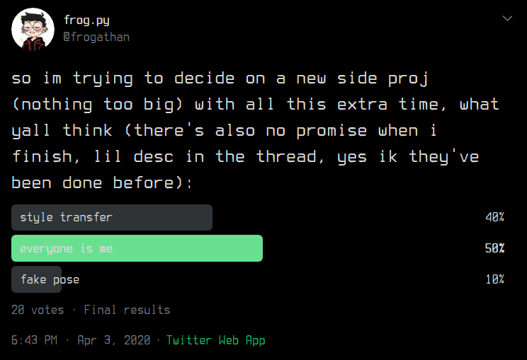

# [04-09-2020] Twitter Poll Projects: Everyone is me [Part 1/???]
This is something I hope to do every-so-often (I won't actually say a concrete interval to give me the flexibility) with the plan of giving myself a fun side-project to do in my freetime that won't take too long. This is also a means of keeping myself up-to-date with the literature in my field. The way I determine the project is by having a public poll [on my twitter.](https://twitter.com/frogathan)

The way I pick these options are purely based on mainstream, relevant thigns that are grabbing my interest. As of right now, my current research focus has been heavily leaning towards computer vision systems so I wanted to try my hand at any of the three. 

The resulting winner was 'Everyone is me' which is essentially a swap face-swap model. I initially thought it'd be cool to do something where the user places two images:
1. First Image contains their face
2. Second Image contains another persons face, or even a family of faces

The result would be that all the faces in the second image being replaced with the users face in the first iamge. It seems fairly straightforward and simple enough but I'm slowly thinking of things to add on to make it a little more fun. This is just a starter post to document the beginning.

*\*\*This is a tag that gets attached to all my Twitter Poll Projects. If you think this is a cool process, you can follow me on [DEV](https://dev.to/lacanlale) for iterative updates. Twitter Poll Projects are also something I like to post about on my [twitter](https://twitter.com/frogathan) and you're also welcome to follow me and give feedback as time goes on. If you have suggestions or ideas that you think are worth trying, feel free to DM me and it might end up in the next poll.\*\**